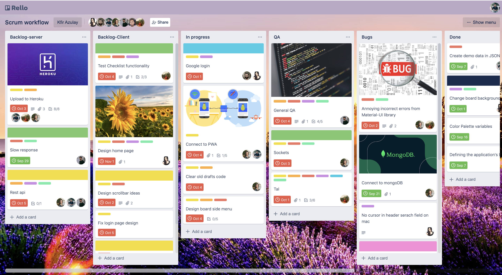
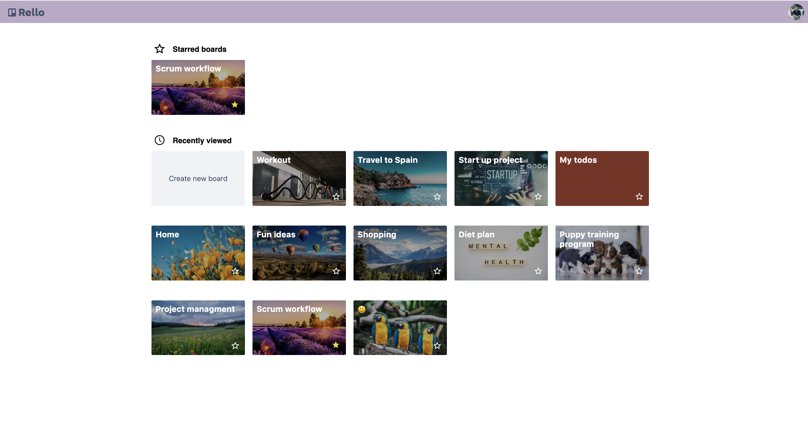
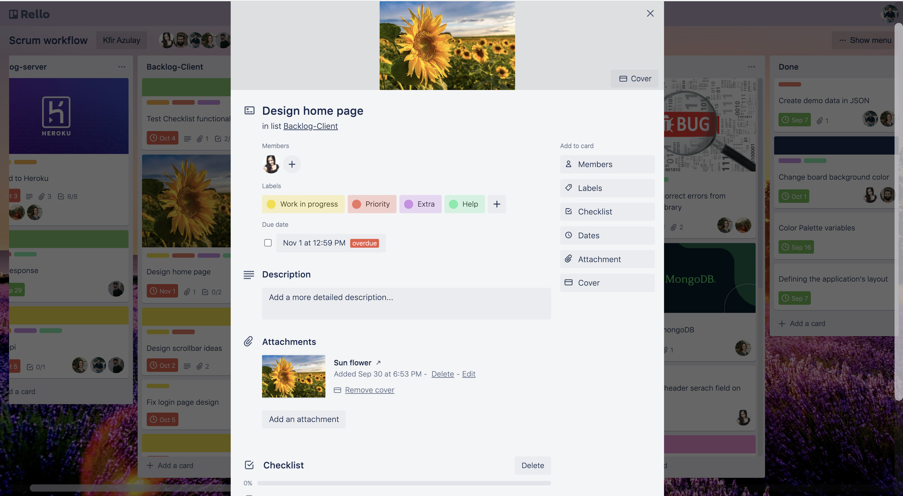
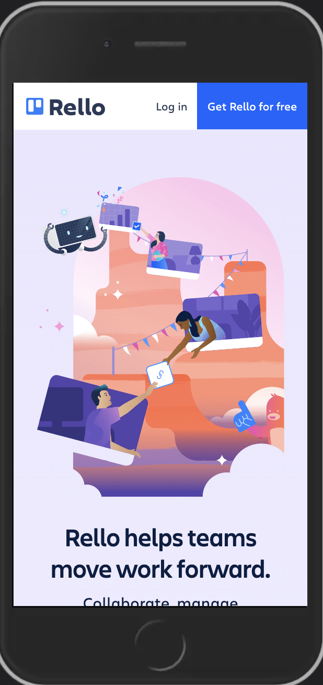
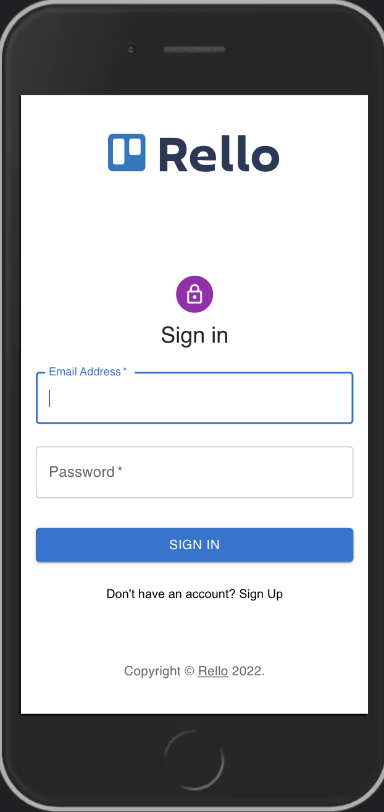
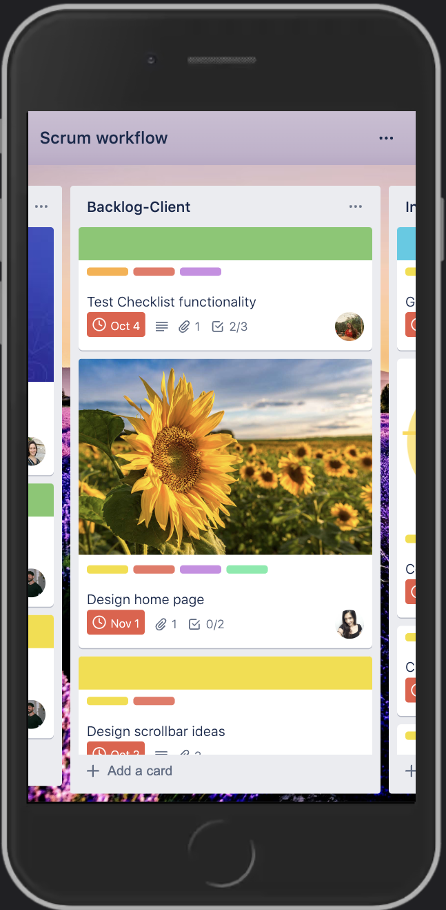
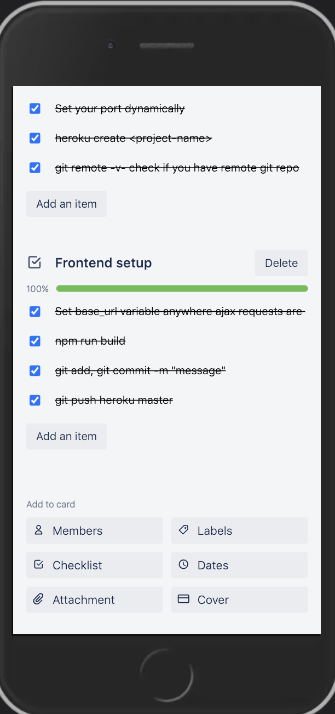

# Rello - pixel prefect, E2E clone of Trello (React + Node.js).

Task and project management board app inspired by trello.com, [here is my project link](https://rello.onrender.com/ "Rello link").


___

### Table of Contents
- [Trello Description](#trello-description)
- [Application Features](#application-features)
- [Technologies](#technologies)
- [Getting started](#getting-started)
- [Showcase](#showcase)

## Trello Description

Trello is an app in which you can manage projects and tasks using a kanban board.
A board contains groups and tasks. Usually each project is a board, and the groups gather in content tabs tasks and topics to accomplish in the project.
Users can modify the board and change tasks locations using Drag and Drop.
Trello lets users work together and watch live changes. There are many other features in Trello,
such as adding members, due date and labels to a specific task. More about it in the [feature section] (#application-features).

## Application Features

- Create ***boards*** and manage projects: using ***D&D***, create, remove, duplicate and update boards, groups and tasks.
- Create, edit, duplicate and remove ***task*** to the deepest level: labels, due date, members, cover images, attachments, description and checklists.
- Side menu - Allowing users to change the board background
- Login with regular authentication which is encrypted and safe.

Of course that we included all the small nuances Trello has. You are not supposed to find any differences!

## Technologies

The technology stack we used was MERN - MongoDB, Express, React, Node.js.
The app uses webSockets to update the board in real time. The API calls to the backend are done with Rest API method.

We have used many third side libraries for many goals, such as D&D and more. The layout and pixel-perfect were made with Sass(functions, mixins, variables).

## Getting started

Head to the repository on top and clone the project or download the files.

```
git clone https://github.com/NogaMorH/sprint4.git
```
Also, clone the backend folder [here](https://github.com/NogaMorH/Rello.git)

Enter the backend folder and make sure you have node_modules installed. After that we will initiate the server with 'npm start':

```
cd backend
npm i 
npm start
```

You shuold get a console ouput that the server is up and running at port 3030.
Enter the frontend folder and repeat the same process.

```
cd frontend
npm i 
npm start
```

You shuold get a console ouput that the server is up and running at localhost:3000.

That's it! The App should be opened automatically, enjoy!

## Showcase

### Homepage

The landing page in which the user can signup/ login or press the try now button to start demo if he is limited with time.


### Workspace

Here users can create a new empty board, navigate between their boards and pin / unpin boards to the starred board list.



### Board

All the functionality that you have in Trello. D&D, live-updates, editing groups and tasks to the deepest level, side menu and much more!


### Task details

In task details users can watch and edit tasks and get live updates. Every button on the right menu opens a dynamic modal which fits the content accordingly to the pressed button.



### Some mobile!

Just a taste of the mobile expirience, We used different mixins, conditional rendering, and the "mobile first" approach. 
The layout we have built from the very first moment enabled us to make the website responsive without a lot of effort.



### Authors
 - [Kfir Azulay](https://github.com/kfirazu)
 - [Noga Mor Havilio](https://github.com/NogaMorH)
 - [Rebecca Krukover](https://github.com/Rebecca-Kruk)


